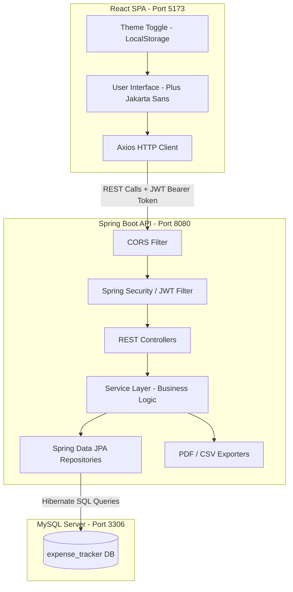
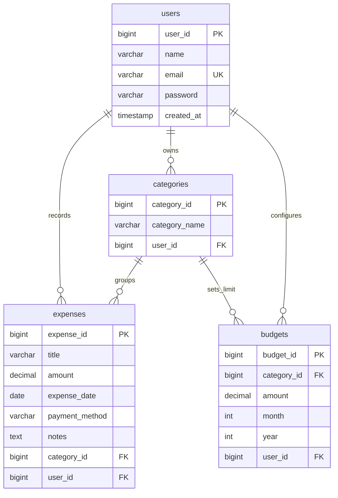

# 🌌 Expense Tracker Web Application (Full-Stack)

A professional, production-ready, and interview-grade **Expense Tracker Web Application** built with **Spring Boot 3 (Java 17)**, **React (Vite + ES6)**, and **MySQL**. This project demonstrates clean architecture patterns, security compliance, transactional resource management, and modern user interface design using glassmorphic principles with a dynamic theme toggle system.

---

## 📂 Complete Folder Structure

```text
expense-tracker/
├── database/                                          # Database schemas & request collection
│   ├── schema.sql                                     # SQL Schema definition & Seed Data
│   └── expense_tracker.postman_collection.json        # Postman Collection for REST APIs
│
├── backend/                                           # Spring Boot Maven Project
│   ├── .mvn/                                          # Maven wrapper files
│   ├── mvnw                                           # Maven Unix wrapper
│   ├── mvnw.cmd                                       # Maven Windows wrapper
│   ├── pom.xml                                        # Maven project dependencies
│   ├── src/
│   │   ├── main/
│   │   │   ├── java/com/expensetracker/
│   │   │   │   ├── ExpenseTrackerApplication.java     # Boot Entry Point
│   │   │   │   ├── config/
│   │   │   │   ├── CategoryInitializer.java       # Startup default category seeder
│   │   │   │   ├── SecurityConfig.java            # Spring Security 6 Configuration
│   │   │   │   └── WebConfig.java                 # Global CORS mapping
│   │   │   ├── controller/
│   │   │   │   ├── AuthController.java            # Signup/Login endpoints
│   │   │   │   ├── BudgetController.java          # Budget Limit mappings
│   │   │   │   ├── CategoryController.java        # Custom/Default Categories
│   │   │   │   ├── ExpenseController.java         # CRUD & PDF/CSV export endpoints
│   │   │   │   └── ReportController.java          # Analytics & Dashboard aggregates
│   │   │   ├── dto/
│   │   │   │   ├── AuthResponseDto.java
│   │   │   │   ├── BudgetDto.java
│   │   │   │   ├── CategoryDto.java
│   │   │   │   ├── DashboardDto.java
│   │   │   │   ├── ExpenseDto.java
│   │   │   │   ├── ReportDto.java
│   │   │   │   ├── UserLoginDto.java
│   │   │   │   └── UserRegisterDto.java
│   │   │   ├── entity/
│   │   │   │   ├── Budget.java
│   │   │   │   ├── Category.java
│   │   │   │   ├── Expense.java
│   │   │   │   └── User.java
│   │   │   ├── exception/
│   │   │   │   ├── BadRequestException.java
│   │   │   │   ├── ErrorResponse.java
│   │   │   │   ├── GlobalExceptionHandler.java
│   │   │   │   └── ResourceNotFoundException.java
│   │   │   ├── repository/
│   │   │   │   ├── BudgetRepository.java
│   │   │   │   ├── CategoryRepository.java
│   │   │   │   ├── ExpenseRepository.java
│   │   │   │   └── UserRepository.java
│   │   │   ├── security/
│   │   │   │   ├── CustomUserDetailsService.java
│   │   │   │   ├── JwtAuthenticationEntryPoint.java
│   │   │   │   ├── JwtAuthenticationFilter.java
│   │   │   │   └── JwtTokenProvider.java
│   │   │   └── util/
│   │   │       ├── CsvExportUtil.java             # Custom CSV writer
│   │   │       └── PdfExportUtil.java             # OpenPDF generation layout
│   │   └── resources/
│   │       └── application.properties             # App configurations
│
└── frontend/                                          # React SPA (Vite Scaffolded)
    ├── package.json                                   # Frontend project package definitions
    ├── package-lock.json                              # Locked npm dependency versions
    ├── vite.config.js                                 # Vite compilation settings
    ├── index.html                                     # Single Page entry template
    ├── .gitignore                                     # Ignored node folders & builds
    ├── src/
    │   ├── main.jsx                                   # React mount bootstrap script
    │   ├── App.jsx                                    # Router config & protected filters
    │   ├── index.css                                  # Custom typography & glass styles
    │   ├── assets/
    │   │   ├── hero.png                               # Branded vector preview header
    │   │   ├── light_bg.png                           # Aurora mesh light background
    │   │   ├── react.svg                              # React SVG asset
    │   │   └── vite.svg                               # Vite SVG asset
    │   ├── components/
    │   │   ├── Layout.jsx                             # Frame layout structure
    │   │   ├── Navbar.jsx                             # Navigation dashboard head bar
    │   │   ├── ProtectedRoute.jsx                     # Private routes auth gate
    │   │   └── Sidebar.jsx                            # Rounded-pill action navigation links
    │   ├── pages/
    │   │   ├── AddExpense.jsx                         # Real-time warning record form
    │   │   ├── Dashboard.jsx                          # Analytical KPI card dashboard
    │   │   ├── ExpenseHistory.jsx                     # Paginated history search table
    │   │   ├── Login.jsx                              # SaaS centered login card
    │   │   ├── Profile.jsx                            # Budget config setting panel
    │   │   ├── Register.jsx                           # SaaS centered sign-up card
    │   │   └── Reports.jsx                            # Monthly aggregate chart reports
    │   ├── services/
    │   │   ├── api.js                                 # Central Axios configuration
    │   │   ├── authService.js
    │   │   ├── budgetService.js
    │   │   ├── categoryService.js
    │   │   ├── expenseService.js
    │   │   └── reportService.js
    └── package.json                                   # Frontend dependencies
    └── vite.config.js                                 # Vite configurations
```

---

## 🔌 Architecture Connection & Flow

The application follows a decoupled client-server architecture model where the **Frontend (React)**, **Backend (Spring Boot)**, and **Database (MySQL)** communicate seamlessly.



### 1. Frontend to Backend Connection
- **HTTP client**: React makes asynchronous requests to the Spring Boot API using **Axios** (scaffolded in `frontend/src/services/api.js`).
- **Base URL Configuration**: Configured with a central endpoint prefix: `http://localhost:8080/api`.
- **JWT Authorization Gating**: Axios interceptors automatically look for the logged-in user's token in browser storage. If a token is found, it is automatically attached to the outgoing request's headers:
  `Authorization: Bearer <JWT_TOKEN>`
- **Cross-Origin Resource Sharing (CORS)**: Since the frontend runs on port `5173` and the backend on `8080`, browser cross-origin blocks are resolved by Spring Boot's [WebConfig.java](file:///c:/Users/PAKKI NAVEEN/OneDrive/Desktop/Expense Tracker/expense-tracker/backend/src/main/java/com/expensetracker/config/WebConfig.java) which whitelists incoming calls, custom headers, and cookies from origin `http://localhost:5173`.

### 2. Backend to Database Connection
- **JDBC Connection Pooling**: Managed by **HikariCP** and configured in [application.properties](file:///c:/Users/PAKKI NAVEEN/OneDrive/Desktop/Expense Tracker/expense-tracker/backend/src/main/resources/application.properties).
- **ORM mapping**: Spring Boot uses **Hibernate** and **Spring Data JPA** to map Java entities (`User.java`, `Expense.java`, `Category.java`, `Budget.java`) directly to MySQL tables.
- **Auto-Initialization**: 
  - `spring.jpa.hibernate.ddl-auto=update` generates the database tables on startup.
  - [CategoryInitializer.java](file:///c:/Users/PAKKI NAVEEN/OneDrive/Desktop/Expense Tracker/expense-tracker/backend/src/main/java/com/expensetracker/config/CategoryInitializer.java) seeds the database with default system categories (Food, Travel, Shopping, Bills, Entertainment, Health, Others) if the table is empty.

---

## 🗄️ Database Design (Normalized Schema)

The database consists of four highly normalized, indexed tables to provide maximum relational integrity.



*Refer to the complete schema script: [schema.sql](file:///c:/Users/PAKKI NAVEEN/OneDrive/Desktop/Expense Tracker/expense-tracker/database/schema.sql)*

---

## 🚀 Installation & Running Guide

### Step 1: Pre-requisites
- **Java Development Kit (JDK)** 17 or higher
- **Node.js** v18+ & **npm**
- **MySQL Database Server** (running locally on port 3306)

---

### Step 2: Database Initialization
1. Connect to your local MySQL server.
2. Execute the database script:
   ```bash
   mysql -u root -p < expense-tracker/database/schema.sql
   ```
   *Alternatively, create the database manually using `CREATE DATABASE expense_tracker;` in your MySQL console. The backend will auto-initialize tables and seed categories on startup.*

---

### Step 3: Backend Configuration & Run
1. Open [application.properties](file:///c:/Users/PAKKI NAVEEN/OneDrive/Desktop/Expense Tracker/expense-tracker/backend/src/main/resources/application.properties).
2. Configure your MySQL credentials:
   ```properties
    spring.datasource.username=YOUR_MYSQL_USERNAME
    spring.datasource.password=YOUR_MYSQL_PASSWORD
   ```
3. Run the Spring Boot application:
   - **On Windows**:
     ```powershell
     cd expense-tracker/backend
     $env:JAVA_HOME="C:\Program Files\Eclipse Adoptium\jdk-17.0.17.10-hotspot"  # If JAVA_HOME is not set
     .\mvnw.cmd spring-boot:run
     ```
   - **On macOS/Linux**:
     ```bash
     cd expense-tracker/backend
     ./mvnw spring-boot:run
     ```
   *The server starts listening on `http://localhost:8080`.*

---

### Step 4: Frontend Configuration & Run
1. Navigate into the frontend folder:
   ```bash
   cd expense-tracker/frontend
   ```
2. Install npm dependencies:
   ```bash
   npm install
   ```
3. Start the Vite React development server:
   ```bash
   npm run dev
   ```
   *The client starts running at `http://localhost:5173`.*

---

## 📑 REST API Documentation

All endpoints (excluding `/api/auth/**`) require a valid JWT passed in the request header:
`Authorization: Bearer <token>`

### 1. Authentication
* **POST** `/api/auth/register` - Creates a new user account.
  * *Request Body*:
    ```json
    { "name": "John Doe", "email": "john@example.com", "password": "password123" }
    ```
* **POST** `/api/auth/login` - Authenticates user.
  * *Request Body*:
    ```json
    { "email": "john@example.com", "password": "password123" }
    ```
  * *Response Body*: Contains JWT token + user name and email.

### 2. Categories Management
* **GET** `/api/categories` - Returns default and user-created categories.
* **POST** `/api/categories` - Creates a custom category.
  * *Request Body*: `{ "categoryName": "Subscriptions" }`
* **DELETE** `/api/categories/{id}` - Deletes custom category (Default categories are protected).

### 3. Expenses Management
* **POST** `/api/expenses` - Records a new expense.
* **PUT** `/api/expenses/{id}` - Modifies a record.
* **DELETE** `/api/expenses/{id}` - Deletes a record.
* **GET** `/api/expenses` - Paginated & sorted filtering feed.
  * *Query Params*: `search`, `categoryId`, `startDate`, `endDate`, `paymentMethod`, `minAmount`, `maxAmount`, `page`, `size`, `sortBy`, `sortDir`
* **GET** `/api/expenses/export/csv` - Streams CSV attachment matching filters.
* **GET** `/api/expenses/export/pdf` - Generates PDF table formatted in Rupees (Rs. / INR).

### 4. Budgets Limits
* **POST** `/api/budgets` - Creates or updates monthly budget limit for a category.
  * *Request Body*: `{ "categoryId": 1, "amount": 5000.00, "month": 6, "year": 2026 }`
* **GET** `/api/budgets?month=6&year=2026` - Lists budget caps, spent totals, and warning flags.

### 5. Report Aggregates
* **GET** `/api/reports/dashboard` - Total, daily, and monthly spent statistics, recent transactions, categories breakdown.
* **GET** `/api/reports` - Historical summary lists grouped by Month, Year, and Categories.

---

## 🎨 Premium Visual Elements & Architecture Features

1. **SaaS Premium Layout & Theme Toggle**:
   - Authentication features a **professional split-screen SaaS layout** combining a clean brand value proposition list on the left with a minimalist centered glassmorphic card on the right.
   - Includes a floating **Theme Toggle** accessible on all views (including Sign In/Register) to instantly switch between dark space and light mesh gradient background styles before and after logging in.
   - Designed with animated ambient backdrop lights (`floatBlob` animation) and high-blur glassmorphic cards.
2. **Fintech Brand Color Coding**:
   - Formatted in **Indian Rupees (₹)** throughout pages, charts, tooltips, tables, and PDF exports.
   - Styled using high-contrast corporate palettes: **Indigo** primary brand colors, **Teal/Emerald** success metrics, and **Rose-Red** warnings.
3. **Real-time Budget Alerts**:
   - The transaction form checks inputs against category budgets in real time. It prints warnings on the screen *before* form submission if saving the expense will exceed the monthly budget limit.
4. **Glossy Button Shimmer**:
   - Primary action buttons feature a dynamic light shimmer animation on hover.
5. **Jira-Style Status Tags**:
   - Categories render as flat modern tags with an aligned color bullet point (`::before` dot) next to the text.
6. **Optimized Database Filtering**:
   - The search feed utilizes a single optimized JPQL query to execute multi-parameter filters (amounts, date ranges, keywords) directly on the DB server, avoiding massive memory footprints.
7. **Interactive Dashboard Visuals**:
   - Employs **Recharts** to display Area graphs and Radial Pie grids representing seasonal and category comparisons with gradient area fills.
